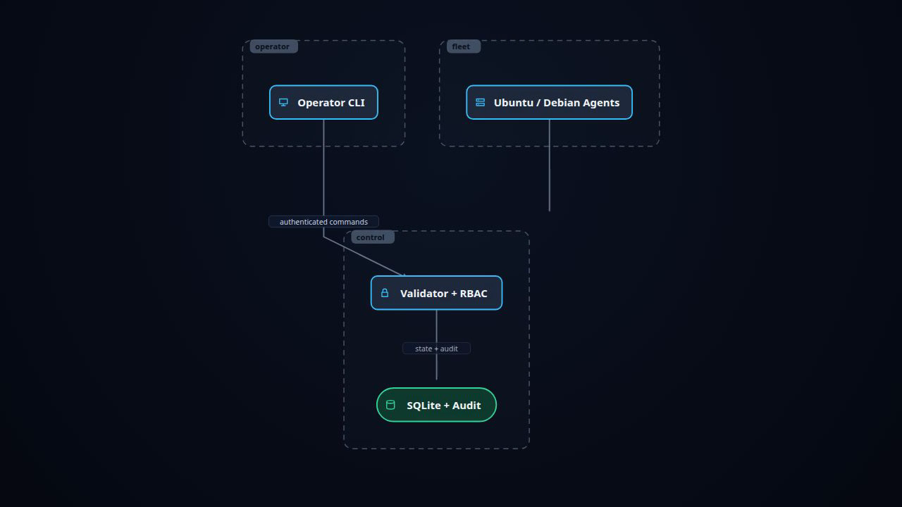

# Silent DevOps

Secure fleet operations for Ubuntu and Debian hosts. Agents run on managed machines, open outbound mTLS connections, publish metrics, and execute authorized maintenance jobs. Validator owns identity, CIDR policy, RBAC, audit, and job state. Operators use scriptable client CLI.

[](docs/media/silent-devops-architecture.mp4)

**[Watch or download architecture animation (MP4)](docs/media/silent-devops-architecture.mp4)**

## Why Silent DevOps

- No inbound agent control port.
- One-time enrollment; agent private key generated and retained on managed host.
- mTLS agent streams with revocation checks.
- `viewer`, `operator`, and `admin` roles; deny by default.
- Typed maintenance for operators. Arbitrary commands and SSH reserved for admins.
- SQLite state, metrics, jobs, and metadata-first audit.
- Bounded messages, queues, command output, and retention.
- Linux amd64 and arm64 binaries.

## Architecture

```text
Operator CLI -- TLS + token --> Validator -- SQLite --> state / audit / metrics
                                   ^
                                   |
                         outbound mTLS streams
                                   |
                         Ubuntu / Debian agents
```

Agent compromise affects one host. Validator compromise is fleet-root threat. Protect validator, CA credentials, DB backups, and network policy accordingly.

## Supported systems

- Ubuntu 22.04 and 24.04
- Debian 12
- Linux amd64 and arm64
- systemd and OpenSSH

## Build and test

Requires Go 1.23+, `protoc`, Docker, Docker Compose, and OpenSSH client tools.

```sh
make generate-check
make fmt-check
make vet
make test
make test-race
make build-linux
make test-e2e
```

Artifacts:

```text
bin/agent-linux-amd64
bin/agent-linux-arm64
bin/validator-linux-amd64
bin/validator-linux-arm64
bin/client-linux-amd64
bin/client-linux-arm64
```

## Install

Download matching release archive on target instance, extract it, then install:

```sh
tar -xzf silent-devops-linux-amd64.tar.gz
cd silent-devops-linux-amd64
sudo ./install.sh
```

Installer places:

- `silent-devops-agent` in `/usr/local/sbin`
- `silent-devops-validator` in `/usr/local/sbin`
- `silent-devops-client` in `/usr/local/bin`
- systemd units in `/etc/systemd/system`

Installation does not invent secrets or enable services. Configure validator and agent credentials first. See [installation guide](docs/installation.md).

## Configure validator

Validator requires:

- TLS server certificate and key
- client trust CA
- encrypted agent-signing CA and protected passphrase
- 32-byte or longer access-token signing key
- enrollment, agent, and client CIDR allowlists
- protected bootstrap-admin credentials for first start

```sh
sudo systemctl edit silent-devops-validator
sudo systemctl enable --now silent-devops-validator
sudo journalctl -u silent-devops-validator -f
```

## Configure agent

Create one-time enrollment token through admin client, enroll agent so its private key is generated locally, then configure validator address and credential directory.

```sh
sudo systemctl edit silent-devops-agent
sudo systemctl enable --now silent-devops-agent
sudo journalctl -u silent-devops-agent -f
```

Agent initiates connection. Do not expose inbound agent control ports.

## CI and releases

GitHub Actions runs formatting, generation checks, vet, tests, race tests, builds all binaries, and uploads Linux amd64/arm64 bundles. Tag `v*` also publishes bundles on GitHub Release.

See [installation guide](docs/installation.md) for release download and instance setup.

## Operations and security

- [Installation and instance setup](docs/installation.md)
- [Operations and security](docs/operations.md)
- [Storage backup and restore](docs/storage.md)
- [Production VM smoke test](docs/vm-smoke-test.md)

> MVP is suitable for controlled evaluation and limited internal deployment. It is not production-hardened for hostile multi-tenant environments. Before broad production rollout, add immediate session revocation, clone detection, signed releases, tamper-evident audit storage, security alerting, tested disk-pressure behavior, and formal PKI revocation.
